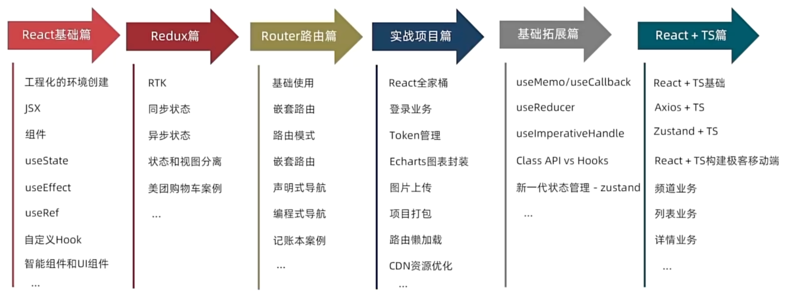

# React前端开发笔记

参考课程:

**【*黑马程序员* React18入门到实战】**

[https://www.bilibili.com/video/BV1ZB4y1Z7o8]

@ZZHow(ZZHow1024)

# 学习路线

React学习路线

# 笔记正文

[**React前端开发_Day1，包含 React 简介、React开发环境创建、JSX基础、React事件绑定、React中的组件、useState、基础样式控制、评论案例 和 classnames优化类名控制**](https://blog.zzhow.com/article/ReactLearning1)
